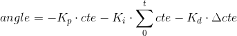
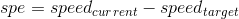
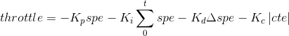

# CarND-Controls-PID
Self-Driving Car Engineer Nanodegree Program

---
## Implementation Details
I used two independent PID controllers to control the steering and the speed of the car. The error for the steering PID controller is given by the simulator as the cross-track error (cte). The error for the speed PID controller is calculated as the difference between the current speed and the target speed, set to 80 mph by default.

### Steering PID Controller


Where:
- **K<sub>p</sub> = 0.16** : forces the vehicle to quickly steer as soon as cte differs from zero. If it is two high with respect of the other parameters, the vehicle begins to oscillate from side to side of the road.
- **K<sub>i</sub> = 0.0002** : ensures that the error between the selected steering angle and the real angle applied is compensated over time.
- **K<sub>d</sub> = 3.46** : allows the vehicle to decrease the steering angle when it is approaching the center of the road and increase the steering angle if cte changes quickly.

### Speed PID Controller




- **speed<sub>target</sub> = 80 mph**
- **K<sub>p</sub> = 0.36** : forces the vehicle to speed up as long as the speed is below the target. If it is two high with respect of the other parameters, the vehicle's speed oscillates around the target speed.
- **K<sub>i</sub> = 0** : we are not considering this term as we are introducing a variable throttle error with K<sub>c</sub> (explained later).
- **K<sub>d</sub> = 0.1** : reduces the vehicle's acceleration if it too high and increases the vehicle's acceleration if it is too low.
- **K<sub>c</sub> = 3.5** : slows down the car when the cross-track error is too high, thus helping the steering PID controller to move the vehicle back to the center of the track. Even though this is not part of the standard PID control process, I added it for safety reasons.

## PID Parameter Optimization

In order to optimize the PID hyper-parameters, I used a combination of manual tuning and twiddle algorithm for fine-tuning. This is the high-level process to optimize parameters:
1. Manual tuning until the vehicle is able to complete the full track at low speed.
2. Twiddle fine-tuning with dKx set to 10% of the associated Kx parameter.
3. Increase speed and tune speed PID controller hyper-parameters manually to keep the vehicle on track.
4. Repeat step 2 until targe speed is 80mph.

### Twiddle
I implemented Twiddle algorithm inside the PID class and transparent to the PID error update iteration. The PID::Init() function has been amended with the following optional parameters to initialize the twiddle algorithm:
- twiddle_count : number of iterations for each parameter update, defaults to 0 if not set
- dKp : initial increment/decrement value for K<sub>p</sub>, defaults to 0 if not set
- dKi : initial increment/decrement value for K<sub>i</sub>
- dKd : initial increment/decrement value for K<sub>d</sub>

When twiddle_count is set to 0, parameter optimization with the twiddle algorithm is effectively turned off. If one of the initial increment/decrement values is set to zero, the optimization is not applied to its associated PID parameter. This is particularly useful to be able to optimize parameters one by one.

It was challenging to apply twiddle because the optimization objective function is not applied in the same track section on each run of the algorithm. Therefore, the number of iterations must be high enough to (1) allow the vehicle to stabilize and (2) to collect enough samples to reduce the track section bias.

## Dependencies

* cmake >= 3.5
 * All OSes: [click here for installation instructions](https://cmake.org/install/)
* make >= 4.1
  * Linux: make is installed by default on most Linux distros
  * Mac: [install Xcode command line tools to get make](https://developer.apple.com/xcode/features/)
  * Windows: [Click here for installation instructions](http://gnuwin32.sourceforge.net/packages/make.htm)
* gcc/g++ >= 5.4
  * Linux: gcc / g++ is installed by default on most Linux distros
  * Mac: same deal as make - [install Xcode command line tools]((https://developer.apple.com/xcode/features/)
  * Windows: recommend using [MinGW](http://www.mingw.org/)
* [uWebSockets](https://github.com/uWebSockets/uWebSockets)
  * Run either `./install-mac.sh` or `./install-ubuntu.sh`.
  * If you install from source, checkout to commit `e94b6e1`, i.e.
    ```
    git clone https://github.com/uWebSockets/uWebSockets
    cd uWebSockets
    git checkout e94b6e1
    ```
    Some function signatures have changed in v0.14.x. See [this PR](https://github.com/udacity/CarND-MPC-Project/pull/3) for more details.
* Simulator. You can download these from the [project intro page](https://github.com/udacity/self-driving-car-sim/releases) in the classroom.

## Basic Build Instructions

1. Clone this repo.
2. Make a build directory: `mkdir build && cd build`
3. Compile: `cmake .. && make`
4. Run it: `./pid`.

## Editor Settings

We've purposefully kept editor configuration files out of this repo in order to
keep it as simple and environment agnostic as possible. However, we recommend
using the following settings:

* indent using spaces
* set tab width to 2 spaces (keeps the matrices in source code aligned)

## Code Style

Please (do your best to) stick to [Google's C++ style guide](https://google.github.io/styleguide/cppguide.html).

## Project Instructions and Rubric

Note: regardless of the changes you make, your project must be buildable using
cmake and make!

More information is only accessible by people who are already enrolled in Term 2
of CarND. If you are enrolled, see [the project page](https://classroom.udacity.com/nanodegrees/nd013/parts/40f38239-66b6-46ec-ae68-03afd8a601c8/modules/f1820894-8322-4bb3-81aa-b26b3c6dcbaf/lessons/e8235395-22dd-4b87-88e0-d108c5e5bbf4/concepts/6a4d8d42-6a04-4aa6-b284-1697c0fd6562)
for instructions and the project rubric.

## Hints!

* You don't have to follow this directory structure, but if you do, your work
  will span all of the .cpp files here. Keep an eye out for TODOs.

## Call for IDE Profiles Pull Requests

Help your fellow students!

We decided to create Makefiles with cmake to keep this project as platform
agnostic as possible. Similarly, we omitted IDE profiles in order to we ensure
that students don't feel pressured to use one IDE or another.

However! I'd love to help people get up and running with their IDEs of choice.
If you've created a profile for an IDE that you think other students would
appreciate, we'd love to have you add the requisite profile files and
instructions to ide_profiles/. For example if you wanted to add a VS Code
profile, you'd add:

* /ide_profiles/vscode/.vscode
* /ide_profiles/vscode/README.md

The README should explain what the profile does, how to take advantage of it,
and how to install it.

Frankly, I've never been involved in a project with multiple IDE profiles
before. I believe the best way to handle this would be to keep them out of the
repo root to avoid clutter. My expectation is that most profiles will include
instructions to copy files to a new location to get picked up by the IDE, but
that's just a guess.

One last note here: regardless of the IDE used, every submitted project must
still be compilable with cmake and make./
